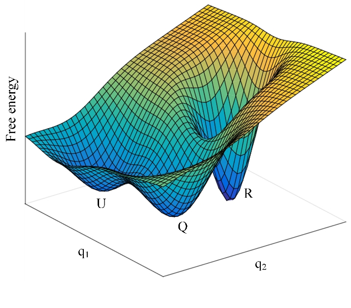

## What are we doing?

**We investigate the energy and structural dynamics of light-harvesting molecular machines
and how they can inspire the next generation of solar cells.**

The light-harvesting protein complexes of photosynthetic organisms are amazing molecular
machines. They use quantum mechanics to optimise their functions, a property that has
captivated physicists for the past few decades. They also feature as light-sensitive
nano-switches to maintain a delicate balance between their light-harvesting and
photoprotective functions. There are a plethora of organisms performing photosynthesis
and the light-harvesting complexes of each photosynthetic organism are different,
sometimes entirely different! Despite the broad variety in structure and composition, the
light-harvesting complexes have one thing in common: they absorb sunlight very
effectively and transport the excitation energy to the photosynthetic reaction centre,
where it is converted into chemical energy, the full process of which has a quantum
efficiency of almost 100%. This property is already one great source of inspiration for
finding green, sustainable energy solutions for humankind.

We want to understand the fundamental properties of these intriguing molecular machines,
especially the transport and regulation of excitation energy. Our state-of-the-art
spectroscopic techniques enable us to unravel many of the otherwise hidden dynamics of
these complex systems. We also investigate to what extent we can improve their
properties, using light, chemistry, and gold or silver nanoparticles as parts of our
toolkit. Using photon correlation spectroscopy, we can get an indication of the
“quantumness” of the light-harvesting complexes as a function of their complexity.

**More realistic environments**

Taking protein complexes out of their native environment is quite a reductionistic
approach. How do we know they behave the same as in their native environment when they’re
isolated and placed in a test tube? The natural environment is too complex to mimic
entirely, so in our test tube the protein complexes will always experience a different
environment. We are therefore developing experimental methods that will enable us to
investigate the protein complexes in more realistic environments, whilst not sacrificing
the level of molecular detail we’re after.

**Artificial photosynthesis**

Every second the earth is lavished with an enormous amount of energy from the sun. So why
doesn’t the whole world switch immediately to solar energy resources? One major challenge
is in the area of light harvesting. We need to think differently about light harvesting
technologies. Photosynthetic organisms use cheap and clean materials for diverse
applications in a remarkably fine-tuned, regulated and economic fashion. There are many
remarkable principles that underlie their function. For example, photosynthetic
light-harvesting complexes (which we may call ‘natural’ solar panels) use a ‘bad’ thing
like disorder for a ‘good’ purpose. Our current solar technologies need a paradigm shift
and learn from nature! Does this mean that our solar panels should be green? Not quite,
but it means that we should apply the design principles gleaned from research on the
‘natural’ solar panels.

## How do we do this?

We use optical spectroscopy as the main experimental tool and strongly back the
experimental work by theoretical modelling. To gain as much from the data as possible
we’re pushing the resolution to the extremes:

1. Femtosecond laser spectroscopy

Using a state-of-the-art setup we can resolve and control processes on timescales down to
tens of femtoseconds. With this resolution one can see how energy flows from one part of
the system to another part.

2. Single-molecule spectroscopy

That’s right: we perform spectroscopy on one molecule at a time! This approach avoids all
sorts of averaging processes, which reveals a lot of new information. We have built (from
scratch) the first single molecule spectroscopy setup on the continent! See the articles
here and here.
